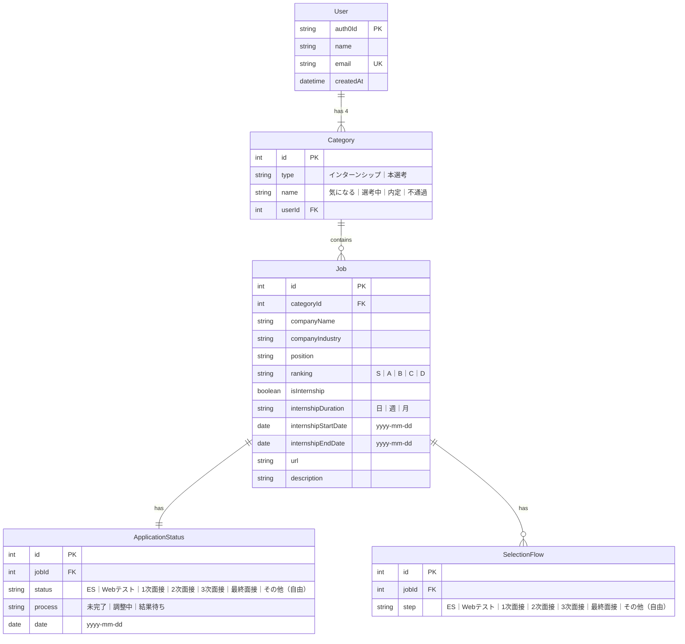

# 内定 Journey

就活管理アプリ

この作品は技育 CAMP のマンスリーハッカソンで作成し、技育展に登壇します

## Installation

Add local environment variable, copy .env.exaaample to .env and edit it based on your environment.

Backend

```
# Backend
$ cp backend/.env.example backend/.env
```

```
POSTGRES_USER=root
POSTGRES_PASSWORD=root
POSTGRES_DB=app

CORS_ORIGIN=http://localhost:3000

AUTH0_DOMAIN=AUTH0_DOMAIN
AUTH0_AUDIENCE=AUTH0_AUDIENCE
```

Frontend

```
# Frontend
$ cp frontend/.env.example frontend/.env
```

```
AUTH0_SECRET=KEY-VALUE
AUTH0_BASE_URL=http://localhost:3000
AUTH0_ISSUER_BASE_URL=https://AUTH0-DOMAIN
AUTH0_CLIENT_ID=AUTH0-CLIENT-ID
AUTH0_CLIENT_SECRET=AUTH0-CLIENT-SECRET
```

Frontend install package

```
$ cd frontend
$ npm install
```

Running docker locally from root directory

```
$ docker-compose up -d --build
```

When server dependencies are updated｜build docker again using above command.

## ER 図


