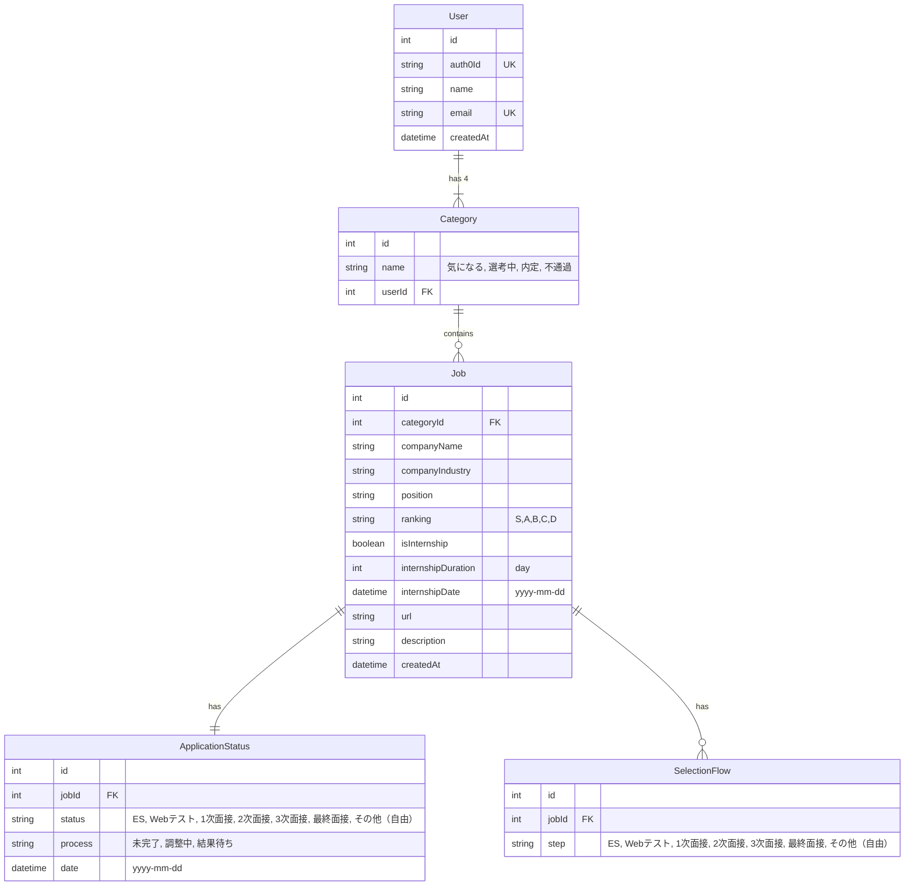

# 内定 Journey

就活管理アプリ

この作品は技育 CAMP のマンスリーハッカソンで作成し、技育展に登壇します

## Installation

Frontend install package

```
cd frontend
npm install
```

Running docker locally

```
docker-compose up -d --build
```

When server dependencies are updated, build docker again using above command.

## ER 図


