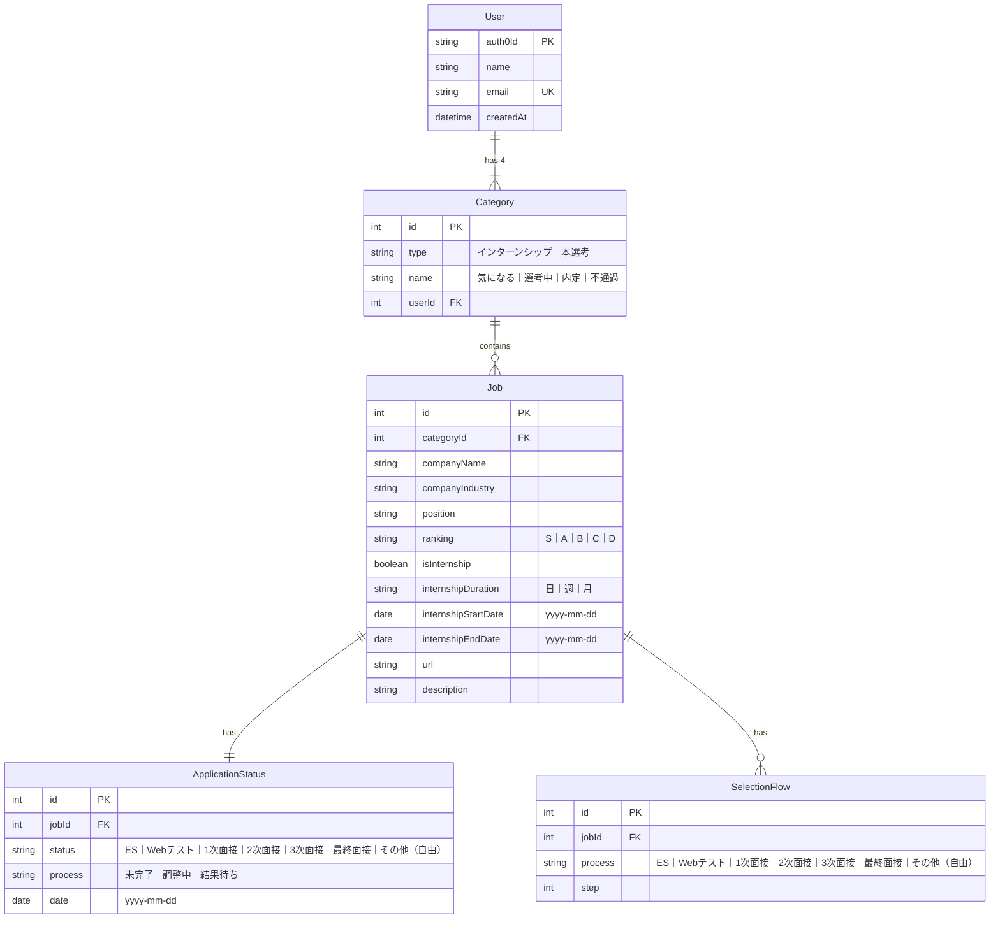

# 内定 Journey

就活管理アプリ

この作品は技育 CAMP のマンスリーハッカソンで作成し、技育展に登壇します

## ローカル環境構築

ローカル環境変数を追加し、.env.example を.env にコピーし、環境に合わせて編集します。

### バックエンド

```
# Backend
$ cp backend/.env.example backend/.env
```

```
POSTGRES_SERVER=naitei-journey-postgres-1:5432
POSTGRES_USER=root
POSTGRES_PASSWORD=root
POSTGRES_DB=app

CORS_ORIGIN=http://localhost:3000

AUTH0_DOMAIN=AUTH0_DOMAIN
AUTH0_AUDIENCE=AUTH0_AUDIENCE
```

### フロントエンド

```
# Frontend
$ cp frontend/.env.example frontend/.env
```

```
AUTH0_SECRET=KEY-VALUE
AUTH0_BASE_URL=http://localhost:3000
AUTH0_ISSUER_BASE_URL=https://AUTH0-DOMAIN
AUTH0_CLIENT_ID=AUTH0-CLIENT-ID
AUTH0_CLIENT_SECRET=AUTH0-CLIENT-SECRET
AUTH0_AUDIENCE=AUTH-API-IDENTIFIER

NEXT_PUBLIC_API_ENDPOINT=http://localhost:8000
```

パッケージのインストール

```
$ cd frontend
$ npm install
```

### アプリを起動

ルートディレクトリからローカルで docker を実行する

```
$ docker-compose up -d --build
```

サーバーの依存関係を更新した場合は、以下のコマンドを実行してコンテナ内の依存関係を更新する必要がある

```
$ docker-compose down
$ docker-compose up -d --build
```

## ER 図


